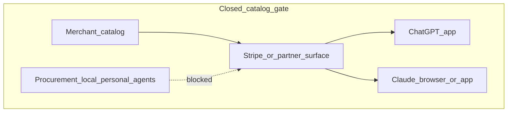
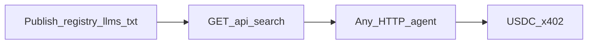
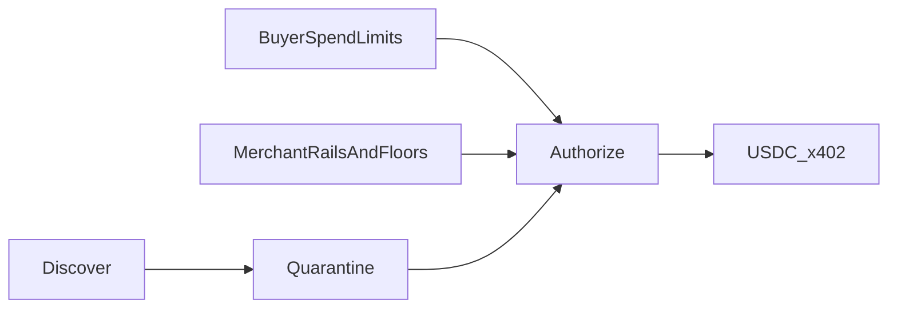

<div align="center">

# Agentize

[](#agentize)
[](#agentize)
[](https://nextjs.org/)
[](#try-it)

**Go agent-ready. Publish once. Any agent can shop you — not only ChatGPT or Claude.**

Landing pitch (merchant-first) → [http://localhost:3000](http://localhost:3000) · Architecture → [`architecture.drawio`](./architecture.drawio)

</div>

---

## The problem

Agent commerce is happening — but **catalogs are walled**.

Stripe-style / Instant Checkout–class listings often live where **ChatGPT** and **Claude** can reach them. Procurement bots, local LLMs, personal agents, and custom runners get **blocked**. Merchants who only list there are invisible to the long tail of agents.

### Impact (structural)

| | |
|---|---|
| **2** | Consumer chat apps get the closed catalog path (ChatGPT, Claude) |
| **0** | Open HTTP surface for everyone else on that same path |
| **∞** | Agent types locked out — procurement, local LLMs, personal agents, Cursor/custom |
| **1 → ~0.1** | For every **1** buyer agent that wants to shop, open protocol still exposes on the order of **~0.1** agent-readable catalogs — most inventory is HTML-only or trapped in those two apps |

> Numbers are structural scarcity, not invented GMV. The bottleneck is **open, machine-readable supply**, not demand for shopping agents.

### Why the closed path loses

1. Reach is **rented from two apps** — not owned as a protocol  
2. Personal / on-prem / procurement agents **cannot shop the same listings**  
3. Merchants stay **invisible** to the long tail of agents  



---

## Agentize

**Open protocol. Any agent. Same settle rails.**

Publish once → humans shop in chat → procurement / local / personal agents hit the same endpoints → settle **USDC** via **HTTP 402 / x402** on Base Sepolia.



| Step | Surface |
|---|---|
| Index | `/registry.json`, `/llms.txt`, `/s/{slug}/llms.txt` |
| Discover | `GET /api/search?q=…` (same ranker for buyer UI + external agents) |
| Buy | `POST /s/{slug}/buy` → **402** → authorize → settle |
| Skill | [`.agents/skills/agentize-registry-shop`](./.agents/skills/agentize-registry-shop/SKILL.md) |

**Do not scrape HTML.** Catalog prose never enters the pay path — settle only sees a locked quote (`storeSlug`, `skuId`, `price`, `merchantAddress`).

---

## What you get

### Merchant-first

- Talk inventory, drop CSV, or paste a store URL → live agent storefront  
- Bind Base Sepolia wallet → list on the open registry  
- Reach **every** HTTP agent, not two chat apps  

### Buyer / any agent

- Fashion salesperson clarifies intent, then ranks via `/api/search`  
- Authorize in chat → USDC x402 on Base Sepolia  
- Injection-shaped listings quarantined; payee/amount stay locked  

### Governance

Buyer spend limits (per tx / day / week). Merchant rails, price floors, market listing — policies that gate checkout.



---

## Try it

```bash
npm install
cp .env.example .env
# Fill BUYER_PRIVATE_KEY, MERCHANT_ADDRESS, Firebase, OPENAI — see scripts/setup-base-sepolia-usdc.md
npm run dev
```

Open [http://localhost:3000](http://localhost:3000).

| Path | What it is |
|---|---|
| `/` | Landing — problem → closed catalogs → open protocol |
| `/merchant` · `/onboard` | Seller chat → publish agent storefront |
| `/buyer` | Fashion chat → USDC x402 settle |
| `/market` | Human + agent marketplace index |
| `/api/search?q=` | Intent search (agents + buyer demo) |
| `/registry.json` | Network store index |
| `/s/{slug}/llms.txt` | Per-store agent discovery |

---

## Get running

### Prerequisites

- Node.js 20+ and npm  
- **OpenAI API key** — buyer / merchant agents (+ Whisper)  
- **Firebase** web config — auth / Firestore  
- **Base Sepolia** — funded buyer EOA + Circle test USDC (see [`scripts/setup-base-sepolia-usdc.md`](./scripts/setup-base-sepolia-usdc.md))

Without `OPENAI_API_KEY`, chat falls back to deterministic tools. Protocol endpoints (`llms.txt`, `/api/search`, HTTP **402**) still work.

### Env (see [`.env.example`](./.env.example))

| Var | Purpose |
|---|---|
| `OPENAI_API_KEY` | Agents + embeddings search |
| `NEXT_PUBLIC_FIREBASE_*` | Buyer + merchant auth |
| `BUYER_PRIVATE_KEY` | Server-side x402 settle (`0x…`) |
| `MERCHANT_ADDRESS` | Default merchant payTo (`0x…`) |
| `BASE_*` / `TOKEN_*` / `X402_FACILITATOR_URL` | Base Sepolia RPC, USDC, facilitator |
| `INTERCEPTA_API_KEY` | Live Intercepta / W3A key ([intercepta.io/ethglobal](https://intercepta.io/ethglobal)) |

---

## Intercepta — seller-first x402 screening

Merchant `/s/{slug}/buy` **refuses dirty payers before facilitator settle**. Buyer-side payTo scan is secondary. Verdicts are live — never mocked.

### Call sites

| File | What |
|---|---|
| [`src/lib/intercepta/client.ts`](./src/lib/intercepta/client.ts) | Live Quick Scan + Deep Scan (`X-API-KEY`) |
| [`src/lib/intercepta/policy.ts`](./src/lib/intercepta/policy.ts) | allow / hold / refuse |
| [`src/lib/protocol/handlers.ts`](./src/lib/protocol/handlers.ts) | **Seller gate** — screen payer (or demo `screenAs`) before `verifyAndSettle` |
| [`src/lib/agents/tools-buyer.ts`](./src/lib/agents/tools-buyer.ts) | Buyer Quick Scan of `payTo`; forwards `screenAs` |
| [`src/app/buyer/_components/intercepta-persona-picker.tsx`](./src/app/buyer/_components/intercepta-persona-picker.tsx) | Honest vs malicious buyer demo |

### Demo (pass + block)

1. Add `INTERCEPTA_API_KEY` from [intercepta.io/ethglobal](https://intercepta.io/ethglobal). Optional: paste Discord-pinned addresses into `INTERCEPTA_DEMO_PERSONAS`. Defaults are public mainnet OFAC/mixer fixtures.
2. **Pass:** `/buyer` → Demo persona **Honest buyer** → authorize USDC → 200 receipt.
3. **Block:** **Pretend to be malicious** → pick Sanctioned / Mixer / Scammer → new chat banner → authorize → merchant **402** with Intercepta reasons (no settle). Reasons show in chat, `/dashboard` Ops, and the failed order.

Settlement still uses `BUYER_PRIVATE_KEY` on Base Sepolia. Intercepta screens the **mainnet** persona address.

### API feedback (Intercepta)

Time to first live call was short: docs + `X-API-KEY` on GET `/quick-scan` were enough. What confused us: risk graphs are mainnet-only, so a funded Sepolia payer always looks clean — the Discord pin / `screenAs` override is required for the blocked path. Missing from public docs: an official fixture list (pins live in Discord) and any non-EVM coverage; we wanted a `chainId` on Quick Scan for testnet context.

### Scripts

| Command | Purpose |
|---|---|
| `npm run dev` | Local Next.js |
| `npm run build` / `npm start` | Production |
| `npm run lint` | ESLint |
