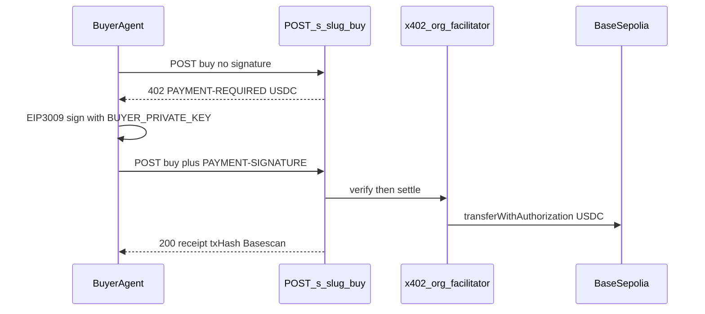

# Base Sepolia USDC x402 settle

## Locked decisions

- **Chain:** Base Sepolia (`eip155:84532`, RPC `https://sepolia.base.org`, explorer Basescan)
- **Token:** Circle USDC `0x036CbD53842c5426634e7929541eC2318f3dCF7e` (6 decimals)
- **Crypto settle:** x402 exact scheme via `@x402/core` + `@x402/evm`; public facilitator `https://x402.org/facilitator`
- **Merchant payTo:** `0x…` bound with MetaMask (EIP-191 personal_sign) — EthGlobal-native
- **Buyer signer:** server `BUYER_PRIVATE_KEY` (same “server pays for demo agent” pattern as today’s `XRPL_BUYER_SEED`)
- **Visa rail:** keep as parallel card path (`/checkout` + local mandate); do not mix chains into that story
- **XRPL/RLUSD:** remove from crypto settle path, UI copy, samples, and deps (`x402-xrpl`, `xrpl`, `ripple-keypairs`)

## Target flow

## Implementation steps

### 1. Config + env

Rewrite `src/lib/config.ts` for EVM:

- `network: "eip155:84532"`, `chainId: 84532`, `rpcUrl` from `BASE_RPC_URL`
- `tokenAddress` / `tokenSymbol: USDC` / `tokenDecimals: 6`
- `facilitatorUrl` from `X402_FACILITATOR_URL` default `https://x402.org/facilitator`
- `merchantAddress` default a demo `0x…`
- `buyerPrivateKey` from `BUYER_PRIVATE_KEY`
- Drop XRPL issuer / sourceTag / `buyerSeed` / RLUSD constants
- `explorerTx` → Basescan `/tx/{hash}`
- Amount helpers: x402 EVM exact scheme uses **atomic** amounts (already have `toAtomic`)

Align `.env.example` and document required keys in `scripts/setup-base-sepolia-usdc.md`. Remove XRPL setup scripts.

### 2. Packages

- Add `@x402/core`, `@x402/evm` (and keep `viem`)
- Remove `x402-xrpl`, `xrpl`, `ripple-keypairs`

### 3. Protocol settle

Rewrite `src/lib/protocol/x402.ts`:

- Build `PaymentRequired` with `scheme: "exact"`, `network: "eip155:84532"`, `asset: USDC`, `payTo: 0x…`, **atomic** `amount`
- Verify/settle via Coinbase facilitator client (`HTTPFacilitatorClient` / resource-server pattern from `@x402/core`) instead of `FacilitatorClient` from `x402-xrpl`

Wire stays at `src/lib/protocol/handlers.ts` `handleBuy` — only requirements + address validation change (`0x` checksum via viem `isAddress`).

Update agent surfaces: `llms-txt.ts`, `registry.ts`, `agent-card.ts` — Base Sepolia / USDC copy.

### 4. Buyer agent payer

Rewrite `src/lib/agents/tools-buyer.ts` `payX402Tool`:

- On 402, sign with `@x402/evm` Exact client + `privateKeyToAccount(BUYER_PRIVATE_KEY)`
- Retry with `PAYMENT-SIGNATURE`
- Error if key missing / wrong network / insufficient USDC

### 5. Merchant wallet auth

Replace XRPL seed flow:

- Restore real `BASE_SEPOLIA` chain metadata
- `authenticateWithMetaMask`: switch/add chain 84532, `personal_sign` bind message, return `0x` proof
- Server `verifyMerchantAuth` with `viem` `verifyMessage`
- Update onboard / merchant setup UIs

### 6. Copy + samples (single story)

Replace hardcoded RLUSD/XRPL strings with USDC / Base Sepolia. Visa UI labels stay “Visa / card”; crypto rail label becomes **USDC on Base Sepolia**.

### 7. Demo readiness checklist (manual)

- Fund buyer with Base Sepolia ETH (gas if needed) + Circle faucet USDC
- Set `MERCHANT_ADDRESS`, `BUYER_PRIVATE_KEY`, `TOKEN_ADDRESS` in `.env.local`
- Smoke: merchant MetaMask bind → publish → buyer agent `/buy` 402→200 → Basescan tx

## Out of scope

- Changing Visa local-mandate `/checkout` behavior
- Live StraitsX MCP / Avalanche Fuji card collateral (leave dormant)
- Mainnet Base or multi-chain support
